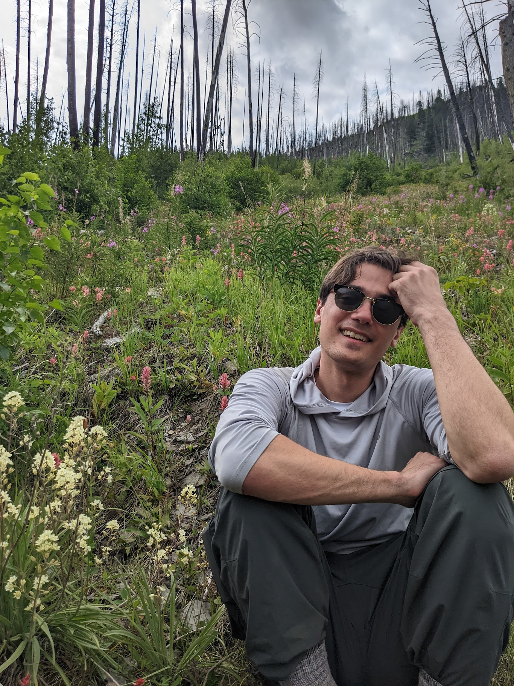

Hello! I'm currently a software engineer at Arcadia, where I focus on modeling and optimizing charging schedules for distributed energy resources.

 Previously, I did a postdoc on machine learning for climate modeling with <a href='https://zanna-researchteam.github.io'>Laure Zanna</a> at NYU, a PhD on interpretable machine learning with <a href='https://finale.seas.harvard.edu' target='_blank'>Finale Doshi-Velez</a> at Harvard, and wrote software at <a href='https://www.vermonster.com' target='_blank'>Vermonster</a>.

